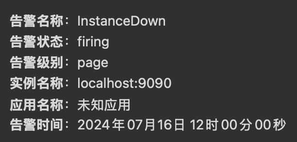

# Prometheus Alertmanager Wechat

## 简介

这是一个基于 Flask 的简单 Web 服务，用于接收 Alert Manager 的告警信息并将其以 Markdown 格式转发到指定的
Webhook URL, 实现告警通知与企业微信群的集成, 效果如下：



## 使用

### 本地

1. 声明环境变量：
    ```sh
    export WEBHOOK_URL="https://qyapi.weixin.qq.com/cgi-bin/webhook/send?key={your own key}"
    ```

2. 运行程序：
    ```sh
   flask run --debug
    ```
3. 测试：
   ```shell
   curl -X POST -H "Content-Type: application/json" -d @data.json localhost:5000/alertinfo
   ```

### 容器化部署

1. 构建镜像:
   ```shell
   docker build . -t prometheus-alertmanager-wechat:v1.0
   ```
2. Docker运行:
   ```shell
   docker run -e "WEBHOOK_URL=https://qyapi.weixin.qq.com/cgi-bin/webhook/send?key={your own key}"  prometheus-alertmanager-wechat:v1.0
   ```
3. Kubernetes运行:
   ```shell
   apiVersion: apps/v1
   kind: Deployment
   metadata:
     name: monitor-alert-wx-adapter
     namespace: monitor
   spec:
     replicas: 1
     selector:
       matchLabels:
         app: monitor-alert-wx-adapter
     template:
       metadata:
         labels:
           app: monitor-alert-wx-adapter
       spec:
         imagePullSecrets:
         - name: img-ca-secret
         containers:
           - name: monitor-alert-wx-adapter
             image: prometheus-alertmanager-wechat:v1.0
             imagePullPolicy: Always
             ports:
               - name: http
                 containerPort: 5000
             env:
               - name: WEBHOOK_URL
                 value: "https://qyapi.weixin.qq.com/cgi-bin/webhook/send?key={your own key}"
   ---
   apiVersion: v1
   kind: Service
   metadata:
     name: monitor-alert-wx-adapter
     namespace: monitor
   spec:
     selector:
       app: monitor-alert-wx-adapter
     type: ClusterIP
     ports:
       - name: http
         targetPort: 5000
         port: 80

   ```
4. 与Alert Manager集成:

```shell
    route:
      group_wait: 10s
      group_interval: 10s
      repeat_interval: 1m

      routes:
        - receiver: 'wechat'
          group_by: ["project"]

    receivers:
      - name: 'wechat'
        webhook_configs:
          - url: 'http://{Docker或K8S部署服务的地址}/alertinfo'
            send_resolved: true
```